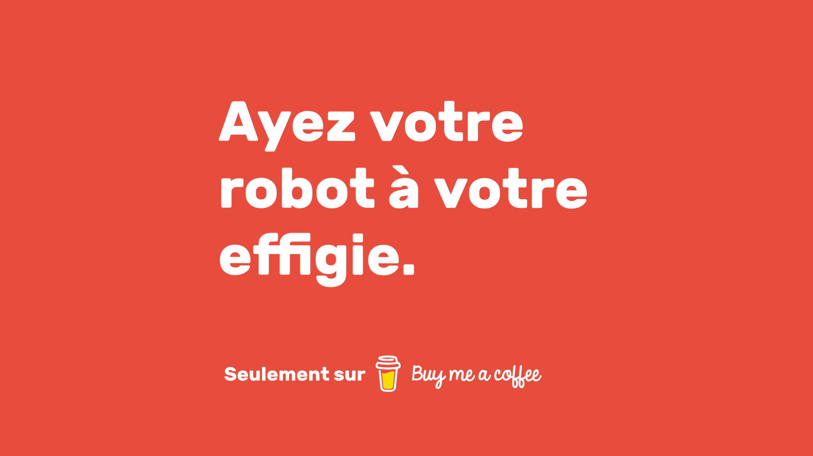

____

## Introduction

> **Warning** 
>
> Vérifiez que votre **Version NodeJS** est supérieure à **16.6.0**.

*Propre, rapide, beau, simple d'utilisation et de modification.*

**Bord Pi** est un robot Discord qui fonctionne avec l'API Discord et le package Discord.js, paramétré en fonction du serveur Discord de [**Thomas Bnt**](https://thomasbnt.dev/discord). Il est néanmoins accessible et facilement possible à le paramétrer à votre façon pour votre propre serveur.

> **Warning** 
> 
> Toutes les configurations sont spécialement pour le serveur où se trouve ce robot. Si vous le testez, vous aurez sûrement des erreurs si vous n'avez pas modifié les ID des salons.

Merci aux Sponsors pour votre soutien ! Si vous aussi, vous voulez aider au développement de plusieurs projets comme celui-ci, n'hésitez pas [à faire une donation](#faire-une-donation).

## Nouveautés

La **version 3** de Bord Pi ajoute la dernière fonctionnalité de Discord : les **Slash Commands**.
Plus aucun préfixe n'est nécessaire pour les commandes.

- [x] Slash Commands
- [x] Commandes de giverôles
- [x] Logs

## Les intégrations

- Le robot comporte un système de **rôles d'accès**, un exemple est donné sur `dev.js` et sert à se procurer un rôle qui, par la suite vous débloque des accès a certains channels suivant votre configuration du serveur.
- Un **filtre contre les liens Discord**, vous pouvez bien évidemment lui ajouter l'ID du channel de publicité dans `IDAdsChannel`. Le robot ne fera rien dans ce channel en question.
- Un **système de logs** interne via Webhooks.
- Un **message de bienvenue personnalisé**.

Pas mal de changements sur le code, notamment le rangement des fichiers, des logs plus propre et un code plus net.
Quant au niveau de la sécurité du robot, il vérifie la plupart du temps s'il peut faire les actions qui voudrait faire, s'il ne peut pas, il passe sans râler. 

## Les permissions

Le robot doit avoir les **Intents privilégié** suivant :

- [x] Server members
- [x] Message content

> **Warning** 
>
> Sans ces intents, le robot ne fonctionnera pas.
Quand vous l'ajouterez sur votre propre serveur, n'oubliez pas de le mettre en privé et de lui donner les permissions suivantes :

Scopes : 
- [x] bot
- [x] applications.commands

Permissions bot : 
- [x] Manage Roles
- [x] Kick members
- [x] Ban members
- [x] Read Messages/View Channels
- [x] Moderate Members
- [x] Send Messages
- [x] Manage Messages
- [x] Embed links
- [x] Attach files
- [x] Read message history
- [x] Add reactions

## Comment le faire fonctionner

1. Assurez-vous d'avoir la version de **NodeJS** supérieure à **16.9.0**.
2. Installez les dépendences avec un coup de `npm install` ou `yarn add`.
3. Copiez le fichier `config.exemple.json` en `config.json`.
4. Remplissez les configurations dans `config.json`.
5. Vous pouvez désormais allumer votre robot avec `npm run start`.

## Contributions

Les contributions sont toujours les bienvenues ! Lisez les règles pour les contributions avant de pouvoir y participer.

Veuillez vous assurer que votre demande de pull request respecte les lignes directrices suivantes :

- Rechercher des suggestions précédentes avant d'en faire une nouvelle, afin d'éviter les doublons.
- Les fichiers README suggérés devraient être beau ou se démarquer d'une manière ou d'une autre.
- Faire une demande de pull request individuelle pour chaque suggestion.
- De nouvelles catégories ou des améliorations à la catégorisation existante sont les bienvenues.
- Gardez les descriptions courtes et simples, mais descriptives.
- Commencez la description avec une capitale et terminez par un arrêt/période complet.
- Vérifiez votre orthographe et votre grammaire.
- Assurez-vous que votre éditeur de texte est configuré pour supprimer les espaces de fin.

Merci pour vos suggestions !

## Les codes couleurs

| **Principaux**       | PrimaryColor | DangerColor | InfoColor | SuccessColor | BlackColor | 
|----------------------|--------------|-------------|-----------|--------------|------------|
| **Code Hexadécimal** | `#E74C3C`    | `#B20000`   | `#6897BB` | `#47b60f`    | `#36393F`  |

Pour les utiliser : `config.colors.PrimaryColor`, récupère la couleur primaire.

## Besoin de se faire héberger son propre robot ?

Si vous le souhaitez, vous pouvez avoir **votre propre robot hébergé** pour votre serveur Discord.
Il serait basé sur ce code, et aura un nom et une image différente que **vous choisirez** ! ✨

## Informations complémentaires

L'image a été modifiée par [Thomas Bnt](https://github.com/thomasbnt), veuillez donc à ne pas l'utiliser publiquement et/ou commercialement.
Initialement, l'image appartient à [Raspberry Pi](https://www.raspberrypi.org/trademark-rules/). 

- 📣 Suis-moi sur [Twitter](https://twitter.com/Thomasbnt_)
- 🔗 Passe un tour sur [mon site web](https://thomasbnt.dev) !

## Faire une donation

 
