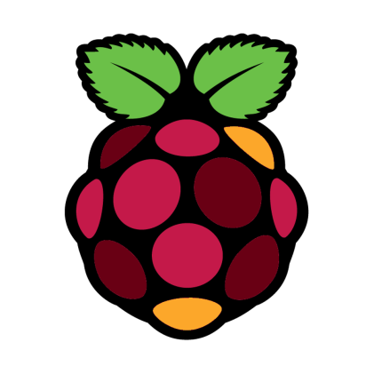

## I Introduction

*Propre, rapide, beau, simple d'utilisation et de modification.*

**Bord Pi** est un robot Discord qui fonctionne avec l'API Discord.js et paramétré en fonction du serveur Discord **La Hype_**.

> ⚠ Toutes les configurations sont spécialement pour le serveur où se trouve ce robot (La Hype_). Si vous le testez, vous aurez sûrement des erreurs si vous n'avez pas modifié les ID des channels.



## II Les intégrations

- Le robot comporte un système de **rôles d'accès**, un exemple est donné sur `mrrobot.js` et sert à se procurer d'un rôle qui, par la suite vous débloque des channels suivant votre configuration du serveur.

- Un **filtre contre les liens Discord**, vous pouvez bien évidemment lui ajouter votre ID channel de publicité en `IDAdsChannel`. Le robot ne fera rien dans ce channel en question.

- Un **système de logs** interne et externe via Webhooks. Pourquoi en avoir deux? L'un est pour le serveur lui-même, et le second sur un serveur de 'backup', mais il vous est utile que d'un seul si vous le souhaitez. En plus, la console est devenue plus jolie que la v1.

- Un **message de bienvenue personnalisé**, avec un système qui vérifie si son compte est bien enregistré ou non en comparant s'il a un avatar par défaut ou non, et s'il y en a un, il démontre comment s'en procurer un en allant sur le support de Discord. 

- Besoin d'une aide particulière auprès d'un rôle? Dès que le rôle est notifié, le robot confirme que ça bien été reçu et que la personne devrait regarder la FAQ si jamais.


- Quelques commandes destiné pour l'équipe. Et certaines sont là pour débugger. 

- Et d'autres commandes peu utiles comme `avatar.js`, `uptime.js` ou encore `ping.js`.

Pas mal de changements sur le code, nottament le rangement des fichiers, des logs plus propre et un code plus net.
Quand au niveau de la sécurité du robot, il vérifie la plupart du temps s'il peut faire les actions qui voudrait faire, s'il ne peut pas, il passe sans râler. 

```js
if (msg.guild.member(bot.user).hasPermission("MANAGE_MESSAGES")) {
    msg.delete(msg.author).catch(e => console.log(bot.ls.warning, "Le robot n'a pas la permission de supprimer la commande faite par l'utilisateur."))
}
```

## III Contributions

Les contributions sont toujours les bienvenues ! Lisez les règles pour les contributions avant de pouvoir y participer.


Veuillez vous assurer que votre demande de pull request respecte les lignes directrices suivantes :

- Alphabétisez votre entrée.
- Rechercher des suggestions précédentes avant d'en faire une nouvelle, comme le vôtre peut être un doublon.
- Les fichiers README suggérés devraient être beaux ou se démarquer d'une manière ou d'une autre.
- Faire une demande de pull request individuelle pour chaque suggestion.
- De nouvelles catégories ou des améliorations à la catégorisation existante sont les bienvenues.
- Gardez les descriptions courtes et simples, mais descriptives.
- Commencez la description avec une capitale et terminez par un arrêt / période complet.
- Vérifiez votre orthographe et votre grammaire.
- Assurez-vous que votre éditeur de texte est configuré pour supprimer les espaces de fin.

Merci pour vos suggestions !


## IV Les codes couleurs


| **Principaux**  | PrimaryColor | DangerColor | InfoColor | SuccessColor | 
|---------|------------|----------|----------|----------|
| **Code Hexadécimal** | #E74C3C   | #B20000  | #6897BB  | #47b60f |

Pour les utiliser : `bot.config.PrimaryColor`, récupère la couleur primaire.

| **Partie**  | Par défaut | Mr. Robøt | The Gate | LoupGarou | Muted |
|---------|------------|----------|----------|----------|----------|
| **Code Hexadécimal** | #E74C3C   | #71368A  | #1F8B4C  | #252132 | #454242 |

## V Informations complémentaires

L'image a été modifié par mes soins, veuillez donc à ne pas l'utiliser publiquement et/ou commercialement. 
Initialement, elle appartient à [Raspberry Pi](https://www.raspberrypi.org/trademark-rules/). 

- 💬  Chat : Rejoins-nous sur [Discord](https://www.thomasbnt.fr/discord/)
- 📣  News : Suis-moi sur [Twitter](https://twitter.com/Hyprimort)
- 📕  Sous licence [GNU GPL v3.0](LICENSE)
- 🔗  Visite le [Site Web](https://www.thomasbnt.fr)
